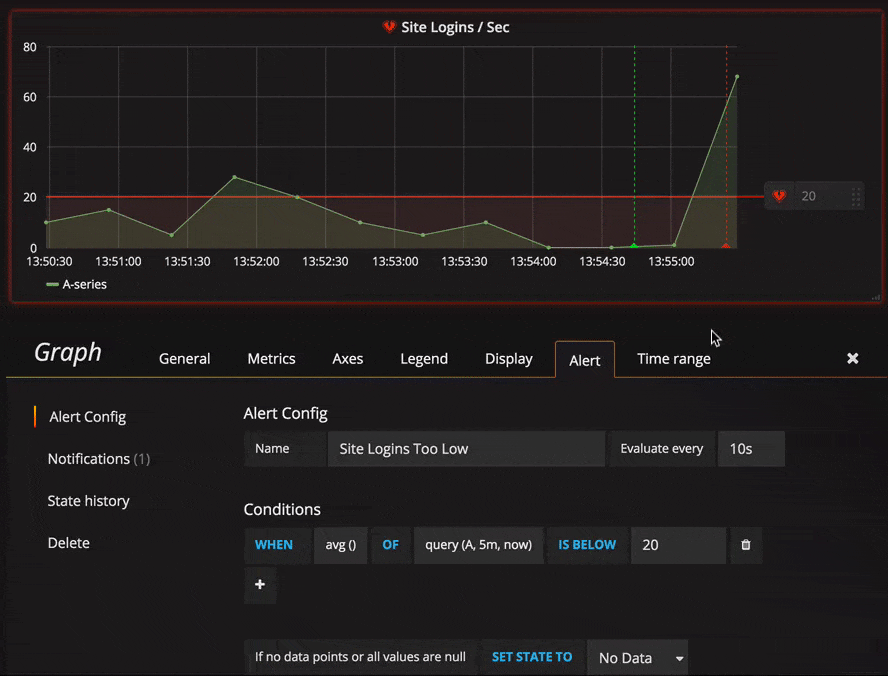

# Monitoring

## Getting Started

1. Download Helm https://github.com/kubernetes/helm/releases 
2. Untar the archive
3. Move it to /usr/local/bin/helm

### Install Heapster

```
helm install --name monitoring -monitoring/
```

### Install Kubernetes Dashboard

```
helm install stable/kubernetes-dashboard
```

## Access Dashboards

```
./grafana.sh
```

## Delete Monitoring Stack

```
helm del --purge monitoring
```

## Creating Alerts




## Setting Kops to log to Cloudwatch

```
additionalPolicies:
    node: |
        [
            {
                "Effect": "Allow",
                "Action": ["logs:CreateLogGroup", "logs:CreateLogStream", "logs:PutLogEvents"],
                "Resource": ["*"]
            }
        ]
    master: |
        [
            {
                "Effect": "Allow",
                "Action": ["logs:CreateLogGroup", "logs:CreateLogStream", "logs:PutLogEvents"],
                "Resource": ["*"]
            }
        ]
docker:
    logDriver: awslogs
    logOpt:
    - awslogs-region=us-west-2
    - awslogs-group=k8s
```

Then run

```
$ kops update cluster --yes # used only to update additional iam policies
$ kops rolling-update --yes --force # used to recreate every k8s cluster members (docker logdriver and logopt will be added to /etc/sysconfig/docker at the first boot)
```